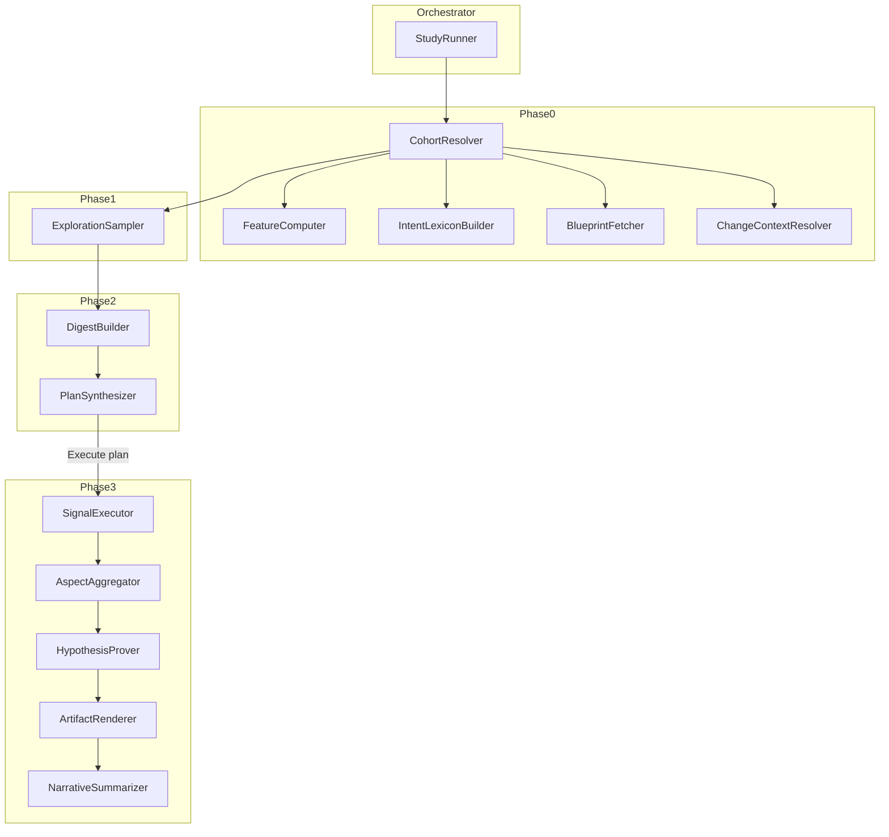

# Ypervaíno — Architecture (v1)

**Status:** Implementation plan for core pipeline logic.  
**Source of truth (model):** [problem_statement_modelling.md](./problem_statement_modelling.md)  
**Inputs / UI:** [input_schema.md](./input_schema.md), [UI_design.md](./UI_design.md)

This document specifies *how* the four pipeline phases are implemented: modules, algorithms, caching, LLM usage, and artifact rendering. It does not redefine the data model — that lives in the modelling doc.

---

## 1. Design principles

1. **Compute once, reuse everywhere** — per-session features are cached under the study directory (optional cross-study cache later).
2. **LLM proposes specs; executor runs them** — regex, keywords, signal definitions, and hypothesis predicates come from Phase 2b `AnalysisPlan`. Phase 3 never invents or tunes specs on `D_eval`.
3. **Deterministic pipelines + structured LLM I/O** — ReAct is used in one place only: `ChangeContextResolver`.
4. **Invariant:** `S_explore` discovers; `D_eval` measures. No hypothesis tuning on evaluation cohort.
5. **Embeddings:** local SBERT (no API) for exploration sampling and pairing.
6. **LLM vendors:** OpenAI primary, Gemini fallback chain (see §10).

---

## 2. System overview



### 2.1 StudyRunner

Owns status transitions (`created` → `explored` → `running` → `complete` | `failed`), study directory I/O, and phase orchestration. HTTP/UI layer calls StudyRunner; it does not contain business logic.

### 2.2 Suggested package layout

```
ypervaino/
  orchestrator/       study_runner.py, study_store.py
  data/               mongo_session_loader.py, trace_fetcher.py, conversation_materializer.py, event_deduper.py
  cohort/             cohort_resolver.py, filter_atom_compiler.py
  features/           feature_computer.py, intent_classifier.py, intent_lexicon.py
  sampling/           exploration_sampler.py
  planning/           digest_builder.py, plan_synthesizer.py, change_context_agent.py
  measurement/        primitive_catalog.py, classical_signals.py, semantic_router.py, predicate_evaluator.py
  evaluation/         phase3_runner.py, aspect_aggregator.py, hypothesis_prover.py, stats_tests.py
  artifacts/          artifact_renderer.py, narrative_summarizer.py
  config/             system_knowledge.yaml, filter_atoms.yaml, primitives.yaml,
                      semantic_methods.yaml, artifact_templates.yaml
```

---

## 3. Persistence & cache

### 3.1 Study directory

Per [problem_statement_modelling.md](./problem_statement_modelling.md) §3.2, plus a cache subtree:

```
studies/{slug}/
  meta.json
  input/create_study.json
  cache/
    intent_lexicon.json
    features/{session_id}.json
  intermediate/
    cohort_stats.json
    blueprint_summary.json
    change_context.json
    s_explore/
      manifest.json
      {session_id}.digest.json
    analysis_plan.json
    timing.jsonl
  output/
    evaluation_result.json
    tables/
    plots/
    per_conversation/
```

### 3.2 Cache keys

```python
events_fingerprint(C) = sha256(session_id, event_count, min_ts, max_ts, last_event_id)

feature_cache_key   = (study_slug, session_id, events_fingerprint, FEATURE_SCHEMA_VERSION)
intent_result_key   = (study_slug, session_id, intent_lexicon.version, events_fingerprint)
```

Recompute when fingerprint changes. Bump `FEATURE_SCHEMA_VERSION` when feature fields change.

### 3.3 FeatureVector (cached per session)

Written by `FeatureComputer`; read by sampling, digests, and Phase 3.

```python
FeatureVector {
  session_id, events_fingerprint, computed_at

  # Primitives (Layer 0)
  turn_count, session_duration_ms, session_outcome
  main_stream_model, tool_invocation_count, tool_error_count
  transfer_completed, guardrail_triggered, interruption_count
  agent_path                          # "welcome→Main_Auth→transfer"

  # Sampling features (Layer 1)
  opening_intent_class, opening_intent_score
  outcome_bucket, length_bucket
  embedding_opening                   # float[384] SBERT

  # Rule-matching index
  searchable_text                     # content + event_value JSON for all events
  matched_tokens                      # normalized token set
  structured_hits {
    agent_names, tool_names, skill_names, node_names, purposes, event_types_seen
  }
}
```

### 3.4 Data sources

| Component | Source | Notes |
|-----------|--------|-------|
| Session index / scope filter | Mongo `AssistantSession` | Read-only; see [`fetch_filtered_session_ids.py`](./fetch_filtered_session_ids.py) |
| Event traces | BotProbe `GET /trace` | Full ES-backed log stream; see [MONGO_LOOKUP.md](./MONGO_LOOKUP.md) §4 |
| VA Blueprint | Bot API or Mongo | Unchanged |

`TraceFetcher` wraps HTTP calls to BotProbe (`BOTPROBE_TRACE_BASE_URL`, `BOTPROBE_TRACE_ENV`). Cache raw traces under `studies/{slug}/cache/traces/{session_id}.json` when fingerprinting features.

Mongo `AssistantEvent` is **not** used for materialization — subset of types only; missing LLM/token events required for cost/latency primitives.

---

## 4. Phase 0 — Cohort resolution

### 4.1 Steps

1. Query Mongo session index by `ScopeFilter` (tenant, assistant, channel, date range, traffic split).
2. For each candidate: `TraceFetcher` → `/trace` → materialize `ConversationRecord`, dedupe events, run `FeatureComputer` (cache).
3. Compile `cohort_filters[]` → `conversation_predicate` via static filter-atom registry ([input_schema.md](./input_schema.md) §2.3).
4. Evaluate cohort predicate using `PredicateEvaluator` over primitives / cheap signals.
5. Fetch VA Blueprint → `VABlueprintSummary` → `intermediate/blueprint_summary.json`.
6. If change fields set: run `ChangeContextResolver` → `intermediate/change_context.json`.
7. Build `IntentLexicon` (one LLM call) + classify opening intent on all cached features.
8. Apply `n_eval` stratified subsample if configured → persist eval cohort ids in `cohort_stats.json`.

### 4.2 FeatureComputer

**Input:** `ConversationRecord`, `VABlueprintSummary`  
**Output:** `FeatureVector` (cached)

Algorithm (single pass over deduped events):

| Field | Derivation |
|-------|------------|
| `turn_count` | count `USER_QUERY` |
| `session_duration_ms` | max − min timestamp |
| `session_outcome` | priority: transfer events → session end status → timeout → completed / unknown |
| `main_stream_model` | last `LLM_INVOCATION_SUCCESS` with `purpose=main_stream` |
| Tool metrics | `TOOL_CALL_RESULT` counts and errors |
| `agent_path` | ordered distinct `RESPONSE.FINAL.agent_name`, joined by `→` |
| `structured_hits` | extract tool/skill/node/agent/purpose names from `event_value` paths in EventSchemaDoc |
| `searchable_text` | concatenate all event content + serialized `event_value` |
| `length_bucket` | short ≤4 turns, medium ≤10, else long |
| `outcome_bucket` | collapsed `session_outcome` for strata |
| `embedding_opening` | SBERT encode first non-welcome `USER_QUERY` |
| `opening_intent_*` | delegate to IntentClassifier (§5) |

---

## 5. IntentClassifier

Two-phase design: one LLM call builds the lexicon; per-conversation classification is rule-based and cached in `FeatureVector`.

### 5.1 Phase A — IntentLexicon (once per study)

**When:** end of Phase 0, after blueprint + event schema available.  
**Persist:** `cache/intent_lexicon.json`

**LLM inputs:**
- `VABlueprintSummary` (skills, tools, dialog nodes, transfer rules)
- `EventSchemaDoc` from SystemKnowledge
- Pilot stats: **200 random sessions from D** → top frequent tool/skill/agent names

**Prompt constraints:**
- Intents are **mutually exclusive** for a conversation's opening intent (exactly one winner).
- Each intent must be classifiable from observable log evidence (names in events/metadata).
- Include explicit `unknown` fallback intent.

**Output:**

```python
IntentLexicon {
  version: string    # hash of blueprint + schema + pilot stats
  intents: {
    [intent_id]: IntentSignature {
      label, description
      skills[], nodes[], tools[], agent_names[]
      event_type_hints[], keywords[], purposes[]
      negative_keywords[]    # optional penalty terms
    }
  }
}
```

### 5.2 Phase B — Rule-based scorer (per conversation)

```python
def classify_opening_intent(C, lexicon, structured_hits, searchable_text) -> (intent_id, score):
    for each intent (except unknown):
        score = weighted hits:
          +3.0 per skill name match (structured set intersection)
          +3.0 per tool name match
          +2.5 per agent_name match
          +2.5 per node name match
          +2.0 per purpose match
          +1.5 per event_type_hint seen
          +1.0 per keyword substring in full searchable_text
          +0.5 bonus if keyword in first 2 USER_QUERY turns
          −2.0 per negative_keyword hit

    best = argmax(score)
    confidence = best_score / sum(positive scores) or 0

    if best_score < MIN_INTENT_SCORE:   # MIN_INTENT_SCORE = 2
        return ("unknown", confidence)
    return (best_id, confidence)
```

Name matching: case-insensitive substring on `searchable_text` **and** normalized set intersection on structured extractions (snake_case normalization for blueprint names).

---

## 6. Phase 1 — Exploration sampling

Uses cached `FeatureVector` for all candidates in `D_filtered`.

### 6.1 Strata

```python
stratum_key(fv) = (fv.opening_intent_class, fv.outcome_bucket, fv.length_bucket)
```

### 6.2 Quota allocation

Proportional to stratum size in D; largest-remainder adjustment so quotas sum to `n_explore`. Prioritize rare `(intent, outcome)` combinations first.

### 6.3 Within-stratum selection

1. Compute embedding centroid per stratum.
2. Pick medoid (closest to centroid).
3. Optional: HDBSCAN / k-means with `k = min(|stratum|, ceil(sqrt(|stratum|)))` → one pick per cluster.
4. Remaining slots: farthest-point sampling on SBERT embeddings.

### 6.4 Comparative pairing

For each selected `c_before`:
- Pool in `D_after`: same `opening_intent_class`, same `outcome_bucket`.
- Filter: `|turn_count_before − turn_count_after| ≤ pairing_turn_tolerance` (default 3).
- Exclude welcome-only sessions (`turn_count < 2`).
- Minimize embedding distance; prefer pairs from different strata.

**Output:** `intermediate/s_explore/manifest.json` (session ids or before/after pairs).

---

## 7. Phase 2 — Plan generation

### 7.1 Phase 2a — DigestBuilder (rule-based, parallel)

**Input:** `ConversationRecord`, `FeatureVector`, optional `cohort_label`  
**Output:** `intermediate/s_explore/{session_id}.digest.json`

```python
ConversationDigest {
  session_id, cohort_label
  opening_intent, outcome, turn_count, duration_ms
  transcript_digest          # FULL transcript — all turns, user + bot
  notable_events[]           # bullets: tool errors, transfers, interruptions, model used
  anomaly_flags[]            # empty tool args, timeout, guardrail block, LLM errors
  primitive_snapshot         # high-signal primitives for this session
}
```

`notable_events` and `anomaly_flags` are rule-derived from event scan. No LLM.

**Additional input for 2b:** attach 2–3 complete transcripts from `S_explore` (shortest, longest, most anomalous by `len(anomaly_flags)`).

### 7.2 Phase 2b — PlanSynthesizer (single structured LLM call)

**Inputs:** all digests, 2–3 full transcripts, EventSchemaDoc, VABlueprintSummary, ChangeContext (if any), SystemKnowledge, change descriptor, cohort predicate summary, allowed artifact template list.

**Output:** `AnalysisPlan` with `user_approved = false` → `intermediate/analysis_plan.json`; status → `explored`.

Post-LLM validation:
1. JSON schema validation.
2. **Closure:** every name in `hypothesis.predicate` ∈ `signals_required ∪ primitives_required`.
3. Regex compile check; reject unsafe patterns.
4. `method` ∈ allowlist in `semantic_methods.yaml`.
5. Blueprint grounding check (warn/reject unknown skill/tool refs).
6. On failure: one retry with error feedback → else `status: failed`.

**Signal spec ownership:** Phase 2b generates all signal specs including regex and keywords. Phase 3 executes them verbatim.

---

## 8. Signal & predicate execution

### 8.1 Three-layer model

| Layer | Executor | LLM in bulk eval? |
|-------|----------|-------------------|
| Primitive | `PrimitiveCatalog` over deduped events | Never |
| ClassicalSignal | `ClassicalSignalRunner` | Never |
| SemanticSignal | `SemanticSignalRouter` by method/tier | Depends on method |

### 8.2 ClassicalSignal kinds

| Kind | Returns |
|------|---------|
| `turn_index` | first turn where condition holds |
| `duration_between` | ms between event A and B |
| `regex_on_transcript` | bool or first-match turn index |
| `agent_path_label` | precomputed `agent_path` from FeatureVector |
| `conditional_metadata` | field from filtered event |

Regex: Python `re`, case-insensitive default; scope `session` (full transcript) or `turn` (per-turn).

### 8.3 SemanticSignal methods

| Method | Phase 3 behavior |
|--------|------------------|
| `rule_based` | score keywords + regex from plan spec against `searchable_text`; bool if `score ≥ min_hits` |
| `zero_shot_llm` | batched LLM classify; **allowed only on capped subsets** — error if invoked on entire `D_eval` |
| `llm_extract` | expensive read of transcript; **counter-examples only** (≤10 sessions per hypothesis) |
| `embedding_nearest_neighbor` | SBERT + prototype labels from plan |

Cost tier enforcement is hard-coded in executor: calling `zero_shot_llm` or `llm_extract` on full `D_eval` raises `ConfigError`.

### 8.4 PredicateEvaluator

Shared by Phase 0 (cohort filter) and Phase 3 (hypothesis match):

```python
Predicate ::= AND | OR | NOT | Comparison | IS_NULL | IN | BETWEEN
Comparison(name, op, value)   # op: == != < <= > >=
```

Per conversation:
```python
values[name] = primitive or signal scalar
match = eval_predicate(hypothesis.predicate, values)
```

---

## 9. Phase 3 — Evaluation

Runs after user clicks **Execute plan** (`user_approved = true`, status → `running`).

### 9.1 Per-conversation loop (batched)

For each `C` in `D_eval`:
1. Compute `primitives_required`.
2. Compute `signals_required` (classical + semantic per method).
3. Write shard to `output/per_conversation/` (optional, for histograms).

### 9.2 Aggregation

- **Aspects:** weighted component aggregation per cohort → `AspectResult` + comparative tests (Mann-Whitney, chi-square, Fisher per value type — see modelling doc §17).
- **Hypotheses:** `support_count`, `match_rate`, cohort comparison, `rejected` if below `min_support`.
- **Counter-examples:** pick k diverse non-matching sessions per hypothesis; optional `llm_extract` on those only.

### 9.3 NarrativeSummarizer

One LLM call over aggregated stats JSON → `artifacts.narrative_summary` (+ optional `recommendations`).

**Output:** `output/evaluation_result.json`; status → `complete`.

---

## 10. ChangeContextResolver (ReAct, capped)

**Trigger:** `change_description` and/or `pr_link` in CreateStudyRequest. Skipped for pure discovery / window comparison with empty change fields.

**Max tool steps:** 5.

| Tool | Purpose |
|------|---------|
| `fetch_mr_metadata(url)` | MR title, description, **auto-generated MR summary** (GitLab/GitHub) |
| `fetch_pr_diff(url)` | file list + patch hunks |
| `read_repo_file(path)` | bot docs (`.context/`, `llm_config.md`, …) |
| `grep_repo(pattern, paths[])` | keyword search |
| `finish(change_context)` | write output and stop |

**Output:**

```python
ChangeContext {
  summary: string
  affected_modules?: string[]
  affected_purposes?: string[]
  affected_event_types?: string[]
}
```

Persist: `intermediate/change_context.json`. Agent has no Mongo access.

---

## 11. ArtifactRenderer

Deterministic post-step after aspect/hypothesis aggregation. No LLM.

### 11.1 Flow

```
For each PlotSpec / TableSpec in AnalysisPlan:
  1. lookup renderer by template id (RENDERER_REGISTRY)
  2. validate bindings (aspect/hypothesis ids exist in EvaluationResult)
  3. extract_data → DataFrame
  4. render → output/plots/{id}.png or output/tables/{id}.csv
  5. register path in evaluation_result.json.artifacts
```

PlanSynthesizer must choose from a closed template list (defined in `config/artifact_templates.yaml`).

### 11.2 Built-in templates (v1)

**Plots:** `aspect_before_after_bar`, `aspect_delta_lollipop`, `hypothesis_rate_comparison`, `distribution_histogram`

**Tables:** `aspect_summary`, `hypothesis_summary`, `cohort_overview`, `counter_examples`

Renderers branch on comparative vs single-cohort study type. Missing data → skip with warning in `timing.jsonl`, not fail Phase 3.

Histograms read `per_conversation` shards for primitive/signal columns.

---

## 12. LLM model selection

OpenAI primary; Gemini fallback on rate limit / 5xx / context overflow.

| Phase / step | Primary (OpenAI) | Context | Fallback chain |
|--------------|------------------|---------|----------------|
| Intent lexicon (once/study) | `gpt-4.1-mini` | ~32k | `gpt-4o-mini` → `gemini-2.0-flash` |
| ChangeContextResolver (ReAct) | `gpt-4.1` | ~128k | `gpt-4o` → `gemini-2.5-pro` |
| Plan synthesis (2b) | `gpt-4.1` | large (~128k+) | `gpt-4o` → `gemini-2.5-pro` |
| Plan validation retry | same as 2b | same | same |
| Semantic `zero_shot_llm` (batched, capped) | `gpt-4.1-mini` | medium | `gpt-4o-mini` → `gemini-2.0-flash` |
| `llm_extract` (counter-examples) | `gpt-4.1` | small | `gpt-4o` → `gemini-2.5-pro` |
| Results narrative | `gpt-4.1-mini` | small | `gpt-4o-mini` → `gemini-2.0-flash` |

**Not LLM:** FeatureComputer, IntentClassifier scoring, ExplorationSampler, DigestBuilder, primitive/classical/rule_based signal execution, ArtifactRenderer, SBERT embeddings.

Before fallback on 2b context overflow: truncate digest batch summaries hierarchically, not raw transcripts.

---

## 13. Logging & timing

Every component emits structured logs to stdout and `intermediate/timing.jsonl`:

```json
{
  "study_slug": "...",
  "phase": "0|1|2a|2b|3",
  "component": "FeatureComputer|IntentLexicon|ExplorationSampler|PlanSynthesizer|SignalExecutor|ArtifactRenderer|...",
  "session_id": "...",
  "duration_ms": 123.4,
  "cache_hit": true,
  "counts": { "sessions_in": 1000, "sessions_out": 842 },
  "llm": { "model": "gpt-4.1", "tokens_in": 4000, "tokens_out": 800 },
  "error": null
}
```

Phase-end summary written to `intermediate/phase_timing_summary.json` with per-component wall time and cache hit rates.

---

## 14. End-to-end trace

```
Submit CreateStudyRequest
│
├─ Phase 0
│   ├─ Mongo session index → candidates
│   ├─ BotProbe /trace → materialize + dedupe + FeatureComputer [cache]
│   ├─ Cohort predicate filter → D_filtered
│   ├─ BlueprintFetcher → blueprint_summary.json
│   ├─ ChangeContextResolver (if change fields) → change_context.json
│   ├─ IntentLexiconBuilder (1 LLM, blueprint + 200-session pilot) → intent_lexicon.json
│   ├─ Classify opening intent on all cached features
│   ├─ n_eval subsample → cohort_stats.json
│   └─ status remains created until Phase 2 completes
│
├─ Phase 1
│   ├─ Strata + quotas + medoid/HDBSCAN + pairing
│   └─ s_explore/manifest.json
│
├─ Phase 2a
│   └─ s_explore/{id}.digest.json (full transcripts, rule-derived bullets)
│
├─ Phase 2b
│   ├─ PlanSynthesizer (1 LLM, validated)
│   └─ analysis_plan.json, status → explored
│
├─ [User: Execute plan]
│
└─ Phase 3
    ├─ SignalExecutor over D_eval (primitives + classical + semantic w/ tier guards)
    ├─ AspectAggregator + HypothesisProver + counter_examples
    ├─ ArtifactRenderer → plots/ + tables/
    ├─ NarrativeSummarizer (1 LLM)
    └─ evaluation_result.json, status → complete
```

---

## 15. Config files (system-facing)

| File | Purpose |
|------|---------|
| `config/system_knowledge.yaml` | cost rules, dedup rules, event schema summary |
| `config/filter_atoms.yaml` | cohort filter chip → predicate compilation |
| `config/primitives.yaml` | Layer 0 catalog |
| `config/semantic_methods.yaml` | method → tier + implementation defaults |
| `config/artifact_templates.yaml` | allowed plot/table templates + binding schemas for PlanSynthesizer |

---

## 16. Explicit non-goals (v1)

- ReAct outside ChangeContextResolver
- Plan revision / re-synthesis loop
- LLM-generated regex at Phase 3 eval time
- `zero_shot_llm` / `llm_extract` on full `D_eval`
- Argus Postgres pipeline
- In-app transcript viewer (BotProbe links only)

---

## 17. Document history

| Version | Date | Notes |
|---------|------|-------|
| v1 | 2026-08-30 | Initial architecture from modelling doc + implementation design discussions |
| v1.1 | 2026-08-30 | Dual-source data layer: Mongo session index + BotProbe `/trace` for events |
